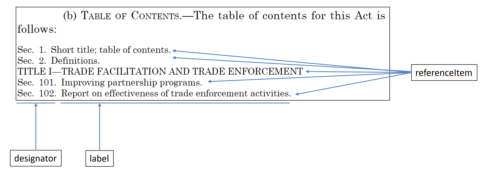
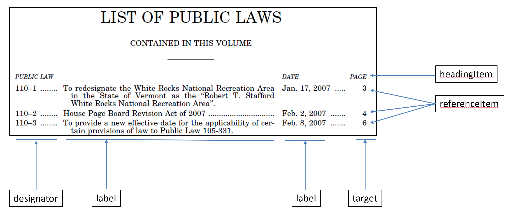
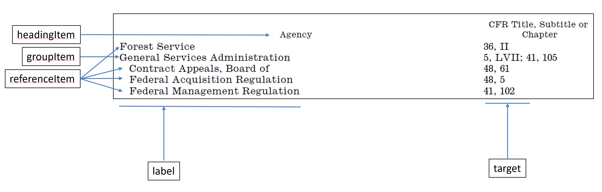
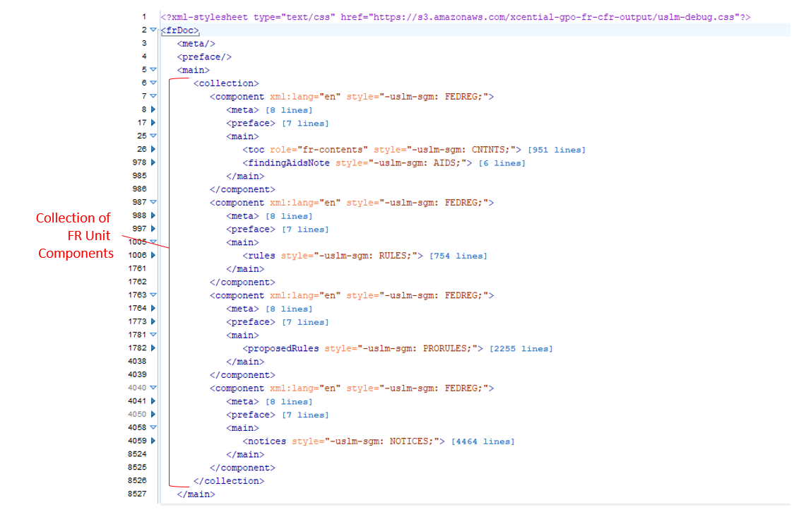
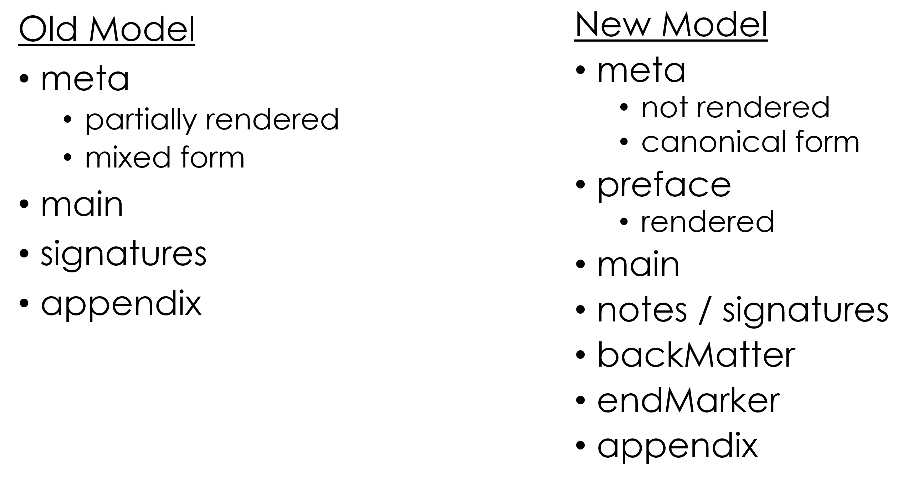
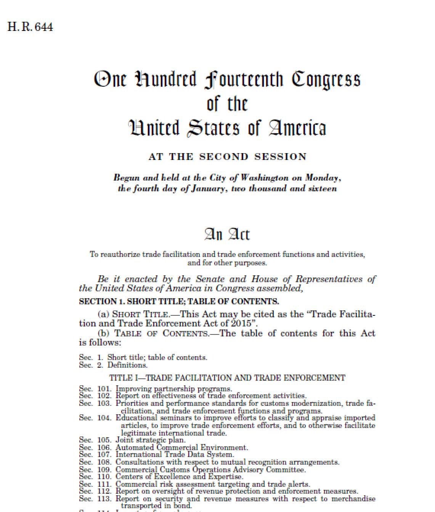
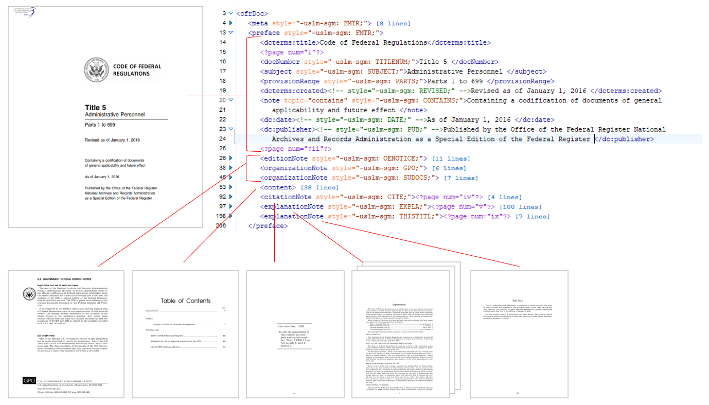

Prepared by: Government Publishing Office

Revised: April 11, 2023

# Contents

[1 Introduction [3](#introduction)](#introduction)

[2 Conventions Used in the User Guide
[3](#conventions-used-in-the-user-guide)](#conventions-used-in-the-user-guide)

[3 Brief USLM Background
[3](#brief-uslm-background)](#brief-uslm-background)

[4 Existing Documentation
[4](#existing-documentation)](#existing-documentation)

[5 What Has Not Changed
[4](#what-has-not-changed)](#what-has-not-changed)

[6 Schema Changes [5](#schema-changes)](#schema-changes)

[6.1 Changed Models [5](#changed-models)](#changed-models)

[6.1.1 Table of Contents and Indexes
[5](#table-of-contents-and-indexes)](#table-of-contents-and-indexes)

[6.1.2 Notes [7](#notes)](#notes)

[6.2 New Models [7](#new-models)](#new-models)

[6.2.1 Collections [7](#collections)](#collections)

[6.2.2 Lists [9](#lists)](#lists)

[6.2.3 Preface [9](#preface)](#preface)

[6.2.4 Back Matter [9](#back-matter)](#back-matter)

[6.2.5 Rule Preamble [9](#rule-preamble)](#rule-preamble)

[6.2.6 Appropriations [9](#appropriations)](#appropriations)

[6.3 New PropertyTypes [10](#new-propertytypes)](#new-propertytypes)

[6.4 New Attributes [11](#new-attributes)](#new-attributes)

[6.5 Model Extensions [11](#model-extensions)](#model-extensions)

[6.5.1 LawDoc [11](#lawdoc)](#lawdoc)

[6.5.2 Level [13](#level)](#level)

[6.5.3 HeadingStructure [13](#headingstructure)](#headingstructure)

[6.5.4 Amendments [13](#amendments)](#amendments)

[6.5.5 Appendix [13](#appendix)](#appendix)

[6.5.6 Signature [13](#signature)](#signature)

[6.6 Tables [13](#tables)](#tables)

[6.7 Document Actions [13](#document-actions)](#document-actions)

[6.8 Document Titles [14](#document-titles)](#document-titles)

[6.9 Content Tagging [14](#content-tagging)](#content-tagging)

[6.10 Page and Line Numbering
[14](#page-and-line-numbering)](#page-and-line-numbering)

[6.11 Other New Elements [14](#other-new-elements)](#other-new-elements)

[7 Feedback [15](#feedback)](#feedback)

[8 Appendix [16](#appendix-1)](#appendix-1)

# Introduction

This Review Guide is intended to help users to understand changes in the
2.0 version of the United States Legislative Markup (USLM) schema so
that users can provide meaningful feedback on the changes. This guide
assumes that the reader is familiar with the 1.0 version of the USLM
schema and is generally knowledgeable about XML schemas in XSD format.
For more information about the 1.0 version, see section 4 of this
document for links to existing documentation.

This guide reflects USLM schema version 2.0.12.

# Conventions Used in the User Guide

The following conventions are used in the User Guide:

- XML element names are denoted with angled brackets. For example,
  \<title\> is an XML element.

- XML attribute names are denoted with an “@” prefix. For example, @href
  is an XML attribute.

- Enumerated values are denoted in courier. For example, landscape is an
  enumeration.

- String values are denoted with double quotes. For example, “title1-s1”
  is a string value.

- A new ***term*** being defined is shown in bold italic.

- A new **element** or **attribute** being defined is shown in bold.

# Brief USLM Background

The USLM schema was first developed in 2013 by the Office of the Law
Revision Counsel of the U.S. House of Representatives (OLRC) in order to
produce the United States Code in XML. Since 2013, the OLRC regularly
produces a USLM version of the United States Code for download at
<http://uscode.house.gov/download/download.shtml>. The USLM version of
the U.S. Code is updated continuously as new laws are enacted.

The original goals of the USLM schema included:

1.  *Allow existing titles of the United States Code to be converted
    into XML.*

2.  *Support ongoing maintenance of the United States Code.*

3.  *Support the drafting of new positive law codification bills and
    related materials.*

4.  *Provide a flexible foundation to meet future needs of Congress.*

5.  *Compatibility with existing legislative documents in other XML
    formats.*

Building on the “flexible foundation” in goal number four above, the
Government Publishing Office (GPO) is coordinating the 2.0 update to
USLM that extends its use to the following document sets[^1]:

- Enrolled Bills

- Public Laws

- Statutes at Large

- Statute Compilations

- Federal Register (FR)

- Code of Federal Regulations (CFR)

# Existing Documentation

User documentation for the 1.0 version of the schema can be found at
<https://github.com/usgpo/uslm/blob/master/USLM-User-Guide.pdf> and
<https://github.com/usgpo/uslm/blob/master/USLM-User-Guide.md>.

The XSD schema and CSS stylesheets for online viewing can be downloaded
at: <http://uscode.house.gov/download/resources/schemaandcss.zip> and
<https://github.com/usgpo/uslm>. Note that the CSS stylesheet is
informational only. It produces a draft view of the documents.

Note: These resources and more are available on GPO’s Developers Hub at
<https://www.govinfo.gov/developers>.

# What Has Not Changed

Version 2.0 of USLM is largely an incremental change to the schema.
While many new elements have been added and several content models have
been extended, the fundamental design of the schema has not changed. The
following principles, documented in the 1.0 User Guide, continue in
version 2.0:

- Abstract and Concrete Models

- Inheritance

- Attribute Model

- Core Document Model

- Metadata Model

- Hierarchy Model

- Versioning Model

- Presentation Model

- Relationship to HTML

- Identification Model

- Referencing Model

Many of these models have been extended to accommodate the additional
document types and their structures. These extensions are
backwards-compatible except in a few cases described below.

# Schema Changes

## Changed Models 

The items described in this section are areas where the structure and
content of the new document types required modifications to the schema
model that are not compatible with the existing 1.0 model.

### Table of Contents and Indexes

The 1.0 model for a Table of Contents (ToC) was format-oriented, using
the \<layout\> tag as a tabular form with rows and columns. The new 2.0
model is semantic, where a ToC consists of a set of “items”.

There are three different types of items:

**\<**referenceItem**\>** *refers to specific content in the document
(versus a concept or a grouping). The referenceItem may also contain
lower level referenceItems if the content being referred to contains
lower level content.*

**\<**headingItem**\>** *a columnar-type heading for the items below it.
e.g. “Sec.” or “Page”. This is commonly repeated on following pages.*

**\<**groupItem**\>** *an item in a ToCIndex that collects a number of
referenceItems or other groupItems under a heading. The groupItem may or
may not refer to a specific place in the document. groupItems may also
contain nested groupItems.*

Each item may consist of one or more of the following elements:

**\<**designator**\>** *a reference to a numbered
item in a table of contents or index.*

**\<**label**\>** *a textual reference in a table of
contents or index.*

**\<**target**\>** *a reference to the target in a
table of contents. This is used to provide various items in the last
column of the multiple column table of contents entry. It has the same
attributes as for references.*

Below are two examples of this ToC model.

This same model, using items, designators, labels and targets, is also
used for indexes that are found in legislative publications, such as the
Popular Name Index. Below is an illustration of how the model can be
used for an index.

Elements of this type are:

> toc, **index, tableOfTitlesAndChapters, listOfAgencies,
> listOfSectionsAffected, listOfBillsEnacted, listOfPublicLaws,
> listOfPrivateLaws, listOfConcurrentResolutions, listOfProclamations,
> popularNameIndex, subjectIndex**

### Notes

In version 1.0 of the schema, all notes had the same model, including
footnotes and U.S. Code notes. The wider variety of notes in other
document types drove a new model that has two types of notes:

#### NoteType Elements

A regular NoteType element is rendered directly in the main content
flow. A U.S. Code note is an example of a NoteType element. Elements of
this type are:

> note, sourceCredit, statutoryNote, editorialNote, changeNote,
> **authority, source, effectiveDateNote, frDocID, billingCode,
> editionNote, organizationNote, citationNote, explanationNote,
> findingAidsNote**

#### PositionNotetype elements

The content of a PositionedNoteType element is rendered at a different
position from where it logically refers. A footnote is an example of a
positioned note. The positioned note has attributes for where it should
be rendered. Elements of this type are:

> footnote, **sidenote, leftRunningHead, rightRunningHead, ear**[^2]**,
> endMarker, page, line**

## New Models

### Collections

Some documents such as the Federal Register are a collection of other
sub-documents. In fact, a daily issue of the Federal Register is a
collection of collections. In order to support this type of document,
USLM 2.0 introduces a new “CollectionType” which is described as:

> ***The collection core type is the basic element in a document that is
> a collection of items, potentially from external sources. Collections
> may contain individual items and/or other collections.***

A \<collection\> will contain a set of \<component\> elements. The
\<component\> element acts as a wrapper for the individual document or
fragment of the collection. The \<component\> may directly contain the
content of the component, or it may point to the content by its @origin
attribute.

The following elements are instances of CollectionType:

> **notices, rules, proposedRules, presidentialDocs, agencyGroup,
> publicLaws, privateLaws, concurrentResolutions**

Below is an example of a collection used to group multiple
document-specific units in an issue of the Federal Register:

**  
**

### Lists

USLM 1.0 does not have a model for lists. It depends on an external
namespace (XHTML) for them. Lists are common, and the requirements are
subtly different from XHTML. Thus, it was determined that USLM 2.0 needs
to have a simple model for them. The relevant elements are:

> **list, listHeading, listItem, listContent**

### Preface

The \<preface\> element is a container for rendered material that
precedes the main body of the document.

> ***Documents may optionally have a preface before the main body of the
> document. Some information in the preface may be duplicated in the
> meta section. The content in the meta section would be normalized,
> whereas the content in the preface would contain the text as it is
> rendered for the user.***

For instance:

\<meta\>\<congress\>115\</congress\>\</meta\>

\<preface\>\<congress\>One Hundred Fifteenth Congress of the United
States\</congress\>\</preface\>

The size and content of a preface can vary widely. For enrolled bills,
the preface includes the Bill ID, the congress and session, and the
enrolled dateline. The preface for a volume of a CFR title includes a
cover page with numerous items, several notes and notices, a Table of
Contents, publisher information, etc. See the illustration below. The
content model for \<preface\> allows the same PropertyType elements as
the \<meta\> section, a table of contents, notes, and other general
content. Examples of these preface elements are in the Appendix.

### Back Matter

Back matter includes indexes, glossaries, lists and other general matter
that may follow the end of the main body of the document. Back matter
does not include appendix material. The back matter of a volume of a CFR
title may be dozens of pages long and include the following: A note on
finding aids, Table of CFR Title and Chapters, List of Agencies, List of
sections affected, and an end marker.

### Rule Preamble

In the Federal Register, each rule has a rule preamble that usually
follows a regular pattern, typically ending with “words of issuance”.

### Appropriations

Appropriation bills have unique constructs when compared to other
legislative proposals. USLM 2.0 adds elements and attributes to capture
the structure and data behind an appropriation account in an
appropriation act.

> ***The \<appropriations\> element is used for nesting the various
> levels of appropriation agencies, bureaus, and departments, as well as
> the various budget areas within agencies, bureaus, and departments.
> The level attribute is used to distinguish major, intermediate, and
> small levels of appropriation language.***

Appropriation attributes:

@level ***The level attribute specifies which level the appropriations
element is. This corresponds to major, intermediate, and small in the
Bill DTD.***

@forType ***The forType attribute defines which type of budget grouping
the appropriation is for (for example, agency, bureau, or account).***

@forvalue ***The forValue attribute defines which budget grouping the
appropriation is for. This could be a URI that points to a web page
giving details of the agency or account, for example.***

## New PropertyTypes

USLM 2.0 defines many more PropertyType elements. These elements are
typically found in the meta and/or preface section of a document and
capture important metadata about the document. This extension allows
modeling of the following new document properties:

> **docStage, docPart, publicPrivate, congress, session, citableAs,
> enrolledDateline, starPrint, processedBy, actionDescription,
> actionInstruction, organization, volume, issue, startingPage,
> endingPage, startingProvision, endingProvision, provisionRange,
> affected, subject, coverTitle, coverText, currentThroughPublicLaw,
> containsShortTitle, createdDate, currentChamber, distributionCode,
> relatedDocument, relatedDocuments**

## New Attributes

A number of new attributes are introduced in USLM 2.0, including:

@styleType *The @styleType attribute is used to set the overall semantic
type of the block. This has rendering implications. Only a predefined
set of values is allowed, which were carried over from Bill DTD and Comp
DTD styles, such as “OLC” and “USC”.*

@scope *Use the @scope attribute to specify the scope within which the
@identifier attribute is valid. Typically, @scope is formatted as a URL,
referring to a specific context. @scope is used for terms within in
definitions to specify the scope of the definition.*

@legisDate *The @legisDate attribute is used for a logical legislative
date, which may be different from the calendar date.*

@verticalSpace *The @verticalSpace attribute indicates the amount of
vertical space associated with a line break (\<br\>) element. If the
attribute is not present, single line (i.e. the next line) is the
default. If the attribute is present, the value is the amount of space
to allow, in addition to the normal position of the next line. The value
may specify units, using CSS syntax (e.g. "4em" or "12pt"). If no units
are given, the units are assumed to be points. The values "nextPage" and
"nextColumn" are used to force a page break or column break.*

@inEffect *@inEffect is a Boolean attribute that is used for provisions
that are not in effect in the law at the time of the document
publication. This attribute is typically used in statute compilations.
The default is “true”.*

In addition to these USLM attributes, attributes from other namespaces
are allowed in various elements, including table elements.

## Model Extensions

The items in this section have been extended from USLM 1.0 for
compatibility. Both existing and new documents are valid against the
extended models.

### LawDoc

The U.S. Code titles have very little prefatory material before the main
body of text and no material after the end of the main body of text.
Some other legislative and regulatory documents have much more material
before and after the main text. To support this, the model for
LawDocType has been extended with optional elements as illustrated
below.

An optional \<preface\> element (discussed above) may come before
\<main\>. The optional elements \<attestation\>, \<signatures\>,
\<notes\>, \<backmatter\>, and \<endMarker\> may follow \<main\> before
an \<appendix\>. This extension allows modelling of the following
documents:

> lawDoc, bill, resolution, uscDoc, **pLaw, statutesAtLarge, amendment,
> frDoc, rule, presidentialDoc, cfrDoc, statuteCompilation**

### Level

The “level” model, used in all hierarchical provisions, allows a more
flexible arrangement of num, heading, ToC, appropriations and appendix
elements within a level. For instance, a \<heading\> can precede \<num\>
which was not allowed in USLM 1.0.

### HeadingStructure

HeadingStructure now allows a more flexible arrangement of headings,
subheadings, and notes.

### Amendments

In order to allow the use of the element \<action\> in the context of
bill actions, the existing use of \<action\> within amendments has been
changed to \<amendingAction\>.

The existing action “renumber” was renamed “redesignate” to better match
the terminology used in Congress. Additional action of “conform” and
“unknown” were added.

### Appendix

The model for \<appendix\> was modified to better match actual appendix
instances (previously unused).

### Signature

The model for \<signatures\> was modified to better match actual
signature instances (previously unused). Elements were added for
**\<notation\>** and **\<autograph\>**.

## Tables

In USLM 1.0, the table model was not defined, and the use of XHTML
tables was encouraged. In USLM 2.0, the table model is still based on
XHTML, but it has been significantly customized to meet the needs of the
documents being modeled. The basic structure is XHTML 1.0, with the
standard \<table\>, \<caption\>, \<thead\>, \<tfoot\>, \<tbody\>,
\<colgroup\>, \<col\>, \<tr\>, and \<td\> elements taken from the XHTML
namespace. Inline, p, and note elements from USLM are allowed in table
cells along with character content. Attributes were added to match USLM
processing needs with similar names to those used in Bill DTD:

**@stubHierarchy**, **@textHierarchy**, **@blockStyle**, **@leaders**,
**@leaderAlign, @id, @identifier, @orientation**

## Document Actions

Legislative actions on a document were modelled more thoroughly.
Elements were added for **\<action\>**, **\<actionDescription\>**,
**\<actionInstruction\>, \<committee\>, \<sponsor\>, \<cosponsor\>,**
and **\<nonsponsor\>**.

An example of these elements in use from 115 HCONRES 18 ENR:

\<action\>  
\<actionDescription\>Agreed to\</actionDescription\>  
\<date date="2017-02-10"\>February 10, 2017\</date\>  
\</action\>

## Document Titles

Legislative document titles were modelled more thoroughly. Elements were
added for **\<longTitle\>**, **\<docTitle\>**, **\<officialTitle\>**,
and **\<shortTitle\>**.

An example of these elements in use from 115 HR 255
ENR:

\<longTitle\>An Act\</docTitle\>  
\<officialTitle\>To authorize the National Science Foundation to support
entrepreneurial programs for women.\</officialTitle\>  
\</longTitle\>

## Content Tagging

Two elements were added for general content tagging.

term *A \<term\> is a word or phrase that is being defined. The \<term\>
element surrounds the words for the term being defined. It is quite
possible for multiple \<term\> elements to be specified within a
definition. When a \<term\> is the words, in the alternate language,
then the xml:lang attribute must be used. \<term\> elements can also be
used for synonyms or near-synonyms which are also specified within the
definition. The containing element (such as a section) has a
@role="definitions" to indicate that definitions are contained within
it.*

entity *An \<entity\> is a generic inline element to identify a text
fragment introducing or referring to an ontological concept. This is
modelled after the Akoma Ntoso \<entity\> element. The @role attribute
can be used to distinguish the concept, for instance, a NAICS code or
SEC code would be \<entity @role="NAICS"\> or \<entity @role="SEC"\>.*

## Page and Line Numbering

**\<page\>** and **\<line\>** elements were introduced to note where
page and line boundaries occurred in a published document. These are
both typed as notes. The content models of some elements were modified
specifically to allow these elements to exist at the actual boundary
locations. Page and line numbers are used for citations and references
in some document types, for example page numbers for citations to
statutes at large.

## Other New Elements

The following new elements were added to support content found in the
new document types and in new stages of existing document types.

(StatementType) \<**resolvingClause\>**, **\<wordsOfIssuance\>**

(ContentType) \<**figure\>**, **\<figCaption\>**

(InlineType) \<**headingText\>**, **\<span\>**, **\<committee\>**

(all doc types) **\<attestation\>**

# Feedback

To submit feedback, questions, or comments about the USLM 2.0 schema and
this Review Guide, please open a GitHub issue at
<https://github.com/usgpo/uslm/issues>.

# Appendix

>  style="width:6.07773in;height:7.14329in" />

Figure 1 Bill Preface

> 

Figure 2 CFR Preface: Content displayed at the beginning of each CFR
title in the preface is shown, including the cover page, official
edition note, GPO and superintendent of documents notes, title contents,
citing note, explanation note, and this title note.

[^1]: *In 2017, the Government Publishing Office and the Office of the
    Federal Register initiated a project to convert a subset of the
    Federal Register and Code of Federal Regulations from SGML into USLM
    XML. The regulatory project was carried out in parallel to a
    legislative project to convert a subset of Enrolled Bills, Public
    Laws, and the Statutes at Large from GPO locator-coded text into
    USLM XML.*

[^2]: An ear contains text to be printed in the outside margin and is
    used in the CFR.
